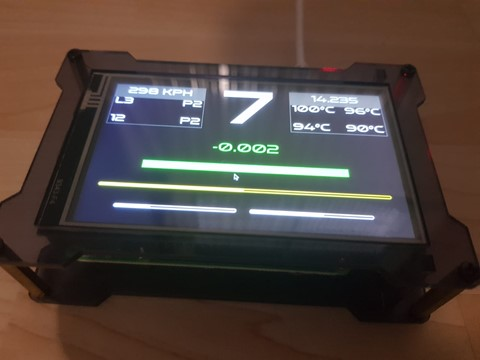
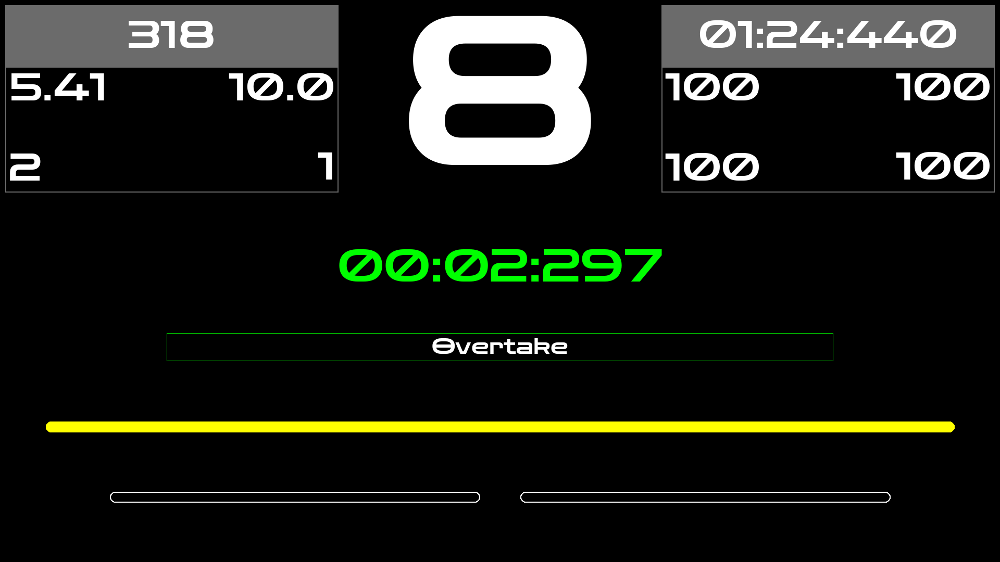
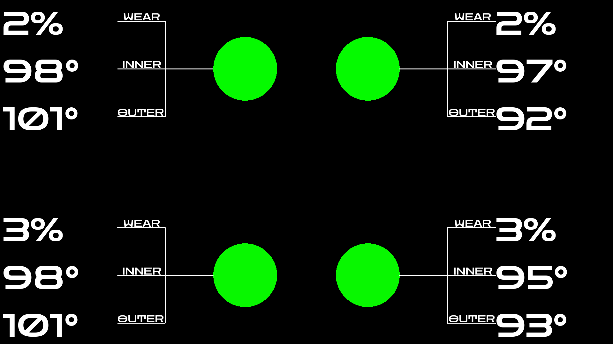

# Dashboard

## Projektvision

Das Computerspielgenre "Rennspiel" lebt von Realismus und einer guten Simulation des Fahrverhaltens. Um einen größeren Spielspaß zu entwickeln, kaufen sich die Spieler ein Lenkrad, anstatt weiter einen Controller zu benutzen. Jedoch können Lenkräder, die einen eingebauten Display (Dashboard) besitzen, schnell einen Preis von über 1000 € haben.

Unser "Racing Dashboard" bietet den Spielern einen erhöhten Realismus und damit eine Chance, sich in Rennspielen weiterzuentwickeln und besser zu werden. Indem Funktionen des Spiels F1 2020 uns ermöglichen, die aktuellen Daten wie Informationen über Wagen, Strecke, Session und Wetter abzugreifen, sind wir in der Lage, dem Spieler mit Live-Daten zu versorgen, um so den Realismus zu steigern.

Das Dashboard ist ein externes Gerät, welches dem Display eines echten Formel 1 Lenkrad ähnelt und die gleichen Funktionen zur Verfügung stellt.

## Projektbeschreibung

Die Komponenten des Dashboardes sind ein Raspberry 3 oder 4 und ein dazu passender Display. Für unser Projekt haben wir dieses [Display](https://www.amazon.de/gp/product/B07XFYXD2V/ref=ppx_yo_dt_b_asin_title_o06_s00?ie=UTF8&psc=1) benutzt.

Mit Hilfe eines Python-Programms verbindet sich der Raspberry über eine UDP-Verbindung mit dem Spiel. Hierbei muss der Raspberry lediglich im selben Netzwerk befinden, wie der Computer, auf dem das Spiel gespielt wird. Daraufhin sendet der Computer die Datenpakete an das Dashboard. Dieser Datenstrom wird kodiert, in Binärform versendet und von dem Python-Programm wieder dekodiert. Diese Informationen beinhalten die Daten der aktuellen Spielsession. Danach werden, mithilfe der Python-Bibliothek Pygame, die Information strukturiert auf dem Bildschirm dargestellt. Dafür haben wir mehrere Pygame-Widgets erstellt um so unsere Screens so variabel wie möglich gestalten zu können. Aktuell haben wir zwei verschiedene Screens. Einmal die SteeringWheelPage, die einem echten Formel-1-Lenkrad sehr nahe kommen soll. Hier findet man Daten wie den aktuellen Gang, die aktuelle Rundenzeit und den ERS-Verbrauch. Der zweite Screen ist die TyreTemperaturePage, welche die Temperatur und den Zustand der Reifen darstellt.

## Bilder

### Dashboard-Ansicht



### SteeringWheelPage



## TyreTemperaturePage



## Installation

Die Repository clonen:

```bash
git clone --recurse-submodules https://github.com/LukasStolz314/Telemetrie
```

### Voraussetzungen

- Python3 pip modules
    - pygame version 2.0.1
    - f1_2020_telemetry
    - pynput
    - argparse

### Lokale Installation

In F1 2020

- Telemetrieeinstellungen → UDP-Broadcasting: AUS
- Telemetrieeinstellungen → UDP-Addresse: 127.0.0.1

Start des Programms

```bash
python3 main.py -i 127.0.0.1 -p 20777
```

### Raspberry Pi Installation

In F1 2020

- Telemetrieeinstellungen → UDP-Broadcasting: AUS
- Telemetrieeinstellungen → UDP-Addresse: Lokale IP des Raspberry Pi's im Netzwerk

Start des Programms

```bash
python3 main.py -i 0.0.0.0 -p 20777
```

## Dokumentation

Für eine ausführliche Dokumentation des Projekts besuchen Sie die [Wiki](https://github.com/isd-nunkesser/sd-2021-bolti/wiki).

---